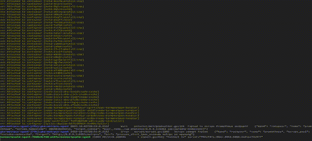

# `ktail` is a tool to tail Kubernetes containers

## It's like `kubectl logs`, but with a bunch of nice features



:white_check_mark: **Detects pods and containers as they come and go**. If you run `ktail foo` and later start a pod or container named `foo`, then it will be picked up automatically. `kubectl` only works on a running pod/container.

:white_check_mark: **Tails multiple pods and containers in multiple namespaces** at the same time, based on names and labels. `kubectl` can only tail a single pod and container. ktail will match the pattern or patterns you specify against both the pod name and the container name.

:white_check_mark: **All containers in a pod are tailed by default**, not just a specific one. With `kubectl`, you have to use `-c`. With ktail, just do `ktail foo` and all its containers are automatically tailed.

:white_check_mark: **Recovers from failure**. ktail will keep retrying forever. `kubectl` often just gives up.

:white_check_mark: **Better formatting**. ktail will show log lines in different colours, and has syntax highlighting of JSON payloads.

# Usage

ktail makes it super easy to tail by pod or container name. The following will match all containers whose pod name or container name contains the substring `foo`:

```shell
$ ktail foo
```

The arguments are regular expressions, so this is possible:

```shell
$ ktail '^foo'
```

If no filters are specified, _all_ pods in the current namespace are tailed.

Tailing supports the usual things like labels:

```shell
$ ktail -l app=myapp
```

This will tail all containers in all pods matching the label `app=myapp`. As new pods are created, it will also automatically tail those, too.

To abort tailing, hit `Ctrl+C`.

## Options

Run `ktail -h` for usage.

## Configuration

Ktail will read the file `$HOME/.config/ktail/config.yml` if it exists. This must be a file in YAML format. The following options can be set (these are the defaults):

```yaml
noColor: false
raw: false
timestamps: false
quiet: false
colorScheme: bw
colorMode: auto
kubeConfigPath: ""
templateString: ""
```

## Templating

ktail has a basic output format. To override, you can use a simple Go template. For example:

```shell
$ ktail -t "{{.Container.Name}} {{.Message}}"
```

The following variables are available:

* `Timestamp`: The time of the log event.
* `Message`: The log message.
* `Pod`: The pod object. It has properties such as `Name`, `Namespace`, `Status`, etc.
* `Container`: The container object. It has properties such as `Name`.

# Installation

## Homebrew

```shell
$ brew tap atombender/ktail
$ brew install atombender/ktail/ktail
```

## Binary installation

Precompiled binaries for Windows, macOS, Linux (x64 and ARM) are available on the [GitHub release page](https://github.com/atombender/ktail/releases).

## From source

This requires Go >= 1.10, as we use Go modules.

```shell
$ mkdir -p $GOPATH/src/github.com/atombender
$ cd $GOPATH/src/github.com/atombender
$ git clone https://github.com/atombender/ktail
$ cd ktail
$ go install .
```

# Acknowledgements

Some setup code was borrowed from [k8stail](https://github.com/dtan4/k8stail).

# License

MIT license. See `LICENSE` file.
